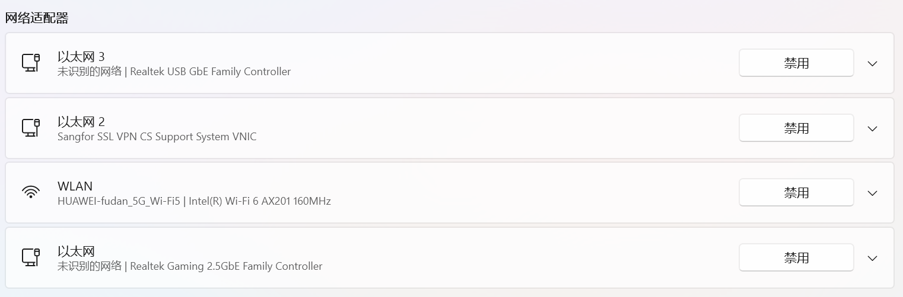
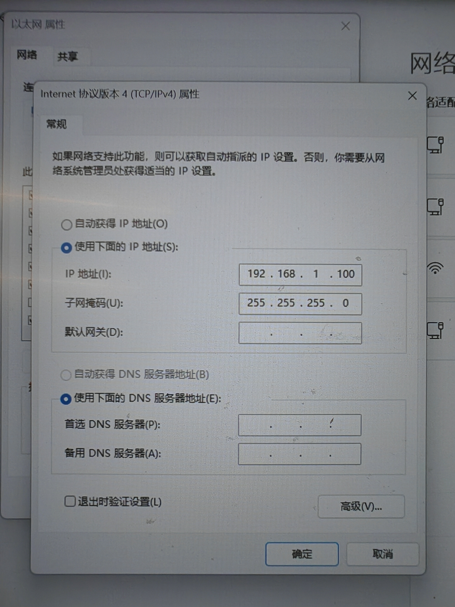
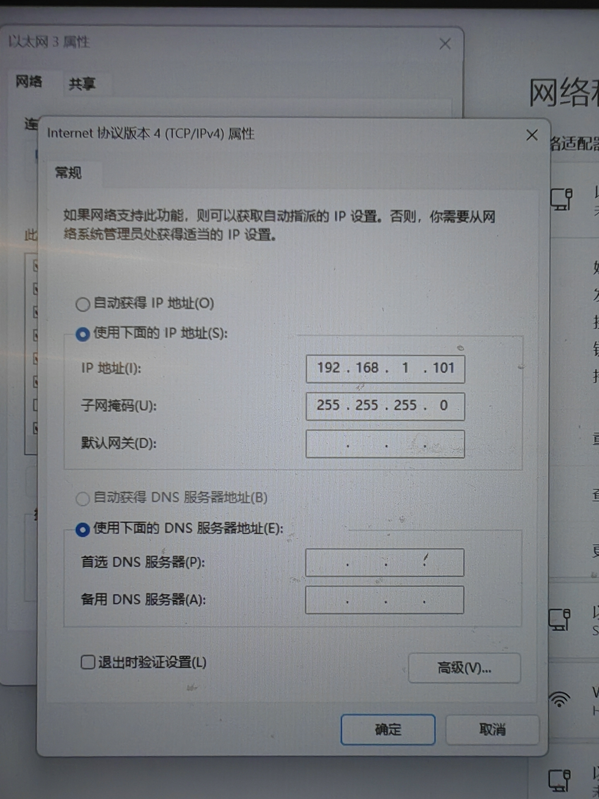

# 机械臂与电脑网络配置

## 1. 配置机械臂和 Windows 网卡

两台机械臂分别设为 `192.168.1.18` 和 `192.168.1.19`（机械臂ip可以通过示教器界面更改）。

电脑通过两根网线连接机械臂时，确认 Windows 中有两个对应的物理网卡：



分别按图配置两个网卡的 IPv4 地址。网卡地址必须与实际接线对应，并与机械臂处于同一网段：




## 2. 配置 WSL 到机械臂的路由

在 WSL 中查询两台机械臂各自使用的网卡和本机地址：

```bash
ip route get 192.168.1.18
ip route get 192.168.1.19
```

核对输出中的 `dev` 和 `src` 与接线、网卡地址相符。若路由不正确，根据实际接线添加主机路由（以下示例为 `.18` 接 `eth1`、`.19` 接 `eth0`）：

```bash
sudo ip route replace 192.168.1.18/32 dev eth1 src 192.168.1.100
sudo ip route replace 192.168.1.19/32 dev eth0 src 192.168.1.101
```

重启 WSL 后路由会丢失时，将上述命令写入启动脚本，并在 `/etc/wsl.conf` 的 `[boot]` 节中设置 `command` 执行该脚本；已有配置应保留。修改后在 PowerShell 执行 `wsl --shutdown`，再启动 WSL。

## 3. 配置驱动 UDP 地址和端口

每个驱动的 `udp_ip` 填对应 `ip route get` 输出中的 `src` 地址。两台机械臂使用不同 UDP 端口，例如：

| 机械臂 IP | `udp_ip` 示例 | `udp_port` 示例 |
| --- | --- | --- |
| `192.168.1.18` | `192.168.1.100` | `8090` |
| `192.168.1.19` | `192.168.1.101` | `8089` |

控制器实时推送目标 IP 和端口必须分别与对应驱动的 `udp_ip`、`udp_port` 一致。

## 4. 允许 Windows 防火墙 UDP 入站

在管理员 PowerShell 中，为每台机械臂及其驱动端口添加入站规则。以下为 `.18` 到 UDP `8090` 的示例；对 `.19` 的 `8089` 同样执行，并相应替换规则名称、端口和来源 IP：

```powershell
New-NetFirewallHyperVRule `
  -DisplayName "Allow WSL2 UDP 8090 from 192.168.1.18" `
  -Direction Inbound `
  -VMCreatorId '{40E0AC32-46A5-438A-A0B2-2B479E8F2E90}' `
  -Protocol UDP `
  -LocalPorts 8090 `
  -RemoteAddress 192.168.1.18

New-NetFirewallRule `
  -DisplayName "Allow WSL2 UDP 8090 from 192.168.1.18" `
  -Direction Inbound `
  -Action Allow `
  -Protocol UDP `
  -LocalPort 8090 `
  -RemoteAddress 192.168.1.18
```

UDP 端口应与驱动配置相同；修改端口或机械臂地址时，同步更新防火墙规则。
